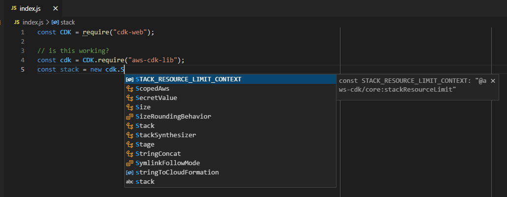
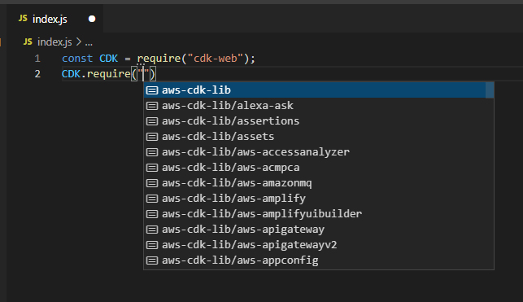

# cdk types and cdk-web's `index.d.ts`

if you are in a node-like environment, you do not need to read this guide.
this is for users who include cdk-web directly by a `<script>` tag in their html.



for your convenience, each cdk-web deployment package also includes a typings file (.d.ts) that allows you to have the
same auto-complete and debugging features available to the native cdk. `aws-cdk-lib`, `constructs`, and cdk-web cli are
also bundled and automatically included when you reference the typings file.

to get types working you need to reference the type file that is shipped by `cdk-web` after `npm install`ing it.

```
/// <reference types="cdk-web" />

// this prints cdk version bundled with cdk-web
console.log(CDK.version);

// you should have typings here
const cdk = CDK.require('aws-cdk-lib')
const ec2 = CDK.require('aws-cdk-lib/aws-ec2')
```

> note that the typings file is currently massive and might break your environment if you don't have a powerful machine.


